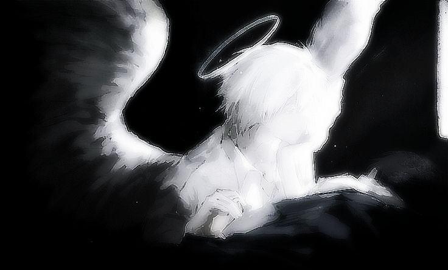

   
  <!-- Ký tự viền ren bằng văn bản cực nghệ -->
  <b>✨ ─── ⋅⚜⋅ ─── ✨</b>
    

  <!-- Ảnh thiên thần sa ngã kèm viền trắng tinh tế giống nick crush -->
    

  <!-- Ký hiệu ngôi sao lấp lánh -->
  <b>─── ⋆⋅☆⋅⋆ ───</b>  

  <!-- Khung lời thoại 1 -->
  <table align="center" border="0" cellpadding="5">
    <tr>
      <td align="center" style="color: #ffffff; font-family: 'Courier New', monospace; font-size: 17px; letter-spacing: 0.5px;">
        🥀 
        <b>" I built a castle out of all the promises you broke. "</b>
      </td>
    </tr>
  </table>
  
   
  <b>⋮</b>
    

  <!-- Khung lời thoại 2 -->
  <table align="center" border="0" cellpadding="5">
    <tr>
      <td align="center" style="color: #ffffff; font-family: 'Courier New', monospace; font-size: 17px; letter-spacing: 0.5px;">
        <b>" You are still my favorite chapter,  even if I'm not in your book anymore. "</b> 
        🖤
      </td>
    </tr>
  </table>

    
  <!-- Ký tự kết thúc dưới cùng -->
  <b>✨ ─── ⋅⚜⋅ ─── ✨</b>
   

